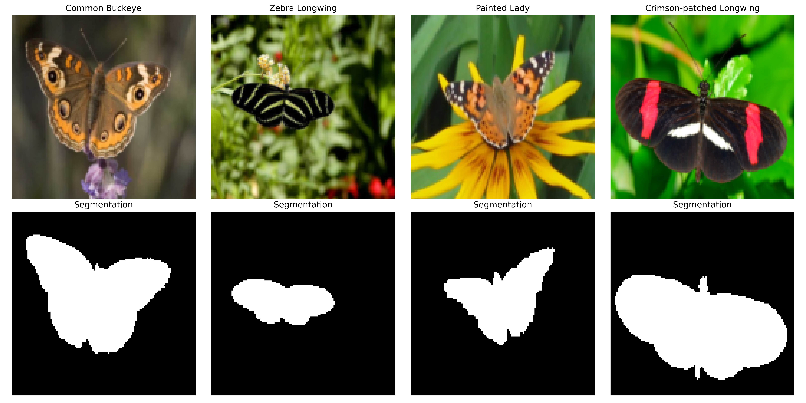
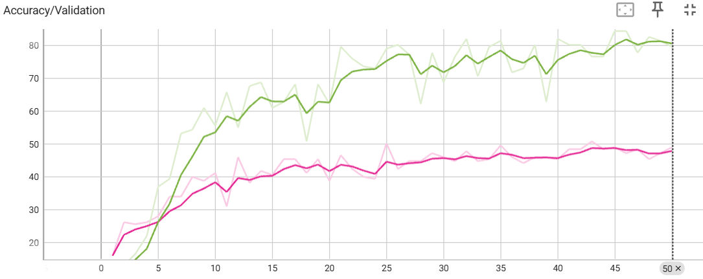

## Butterfly Classification and Segmentation
The project performs Deep Learning on a set of butterfly images to extract classification and segmentation models.  The dataset is downloaded from the Kaggle repository [Butterfly Dataset](https://www.kaggle.com/datasets/veeralakrishna/butterfly-dataset).  

### Original dataset creation:
Josiah Wang, Katja Markert, and Mark Everingham  
Learning Models for Object Recognition from Natural Language Descriptions  
In Proceedings of the 20th British Machine Vision Conference (BMVC2009)

## Training Approach
The training is performed using Python's Pytorch library.  The [colab_notebook](colab_notebook.py) is coded to set up a Google Colab environment, import the necessary files, load the dataset, and perform the training.  The training is relatively quick using available GPU resources.   Both Multilayer Perceptron (MLP) and CNN-RESNET (Convolutional Network with Residual Layers) were used to perform the training.  

## Example images
The dataset includes approximately 800 images of butterflies from 10 different species.  Segmentation masks are also included with the dataset for segmenetation training. An example of 4 images are shown below.

## Classification Training
The dataset is split 80/20 into training/validation sets.  Both Multilayer Perceptron (MLP) and CNN-RESNET (Convolutional Network with Residual Layers) were used to perform the training for classification.  As expected CNN performed signficantly better achieveing approximately 80% accuracy on the validation set compared to 60% with MLP. Both models are relatively small.  Images from tensorboard that tracks the accuracy improvement is shown below.

## Segmentation Training
Segmentation training is performed using a U-NET model that implements convolutional networks.  (more to come...)
